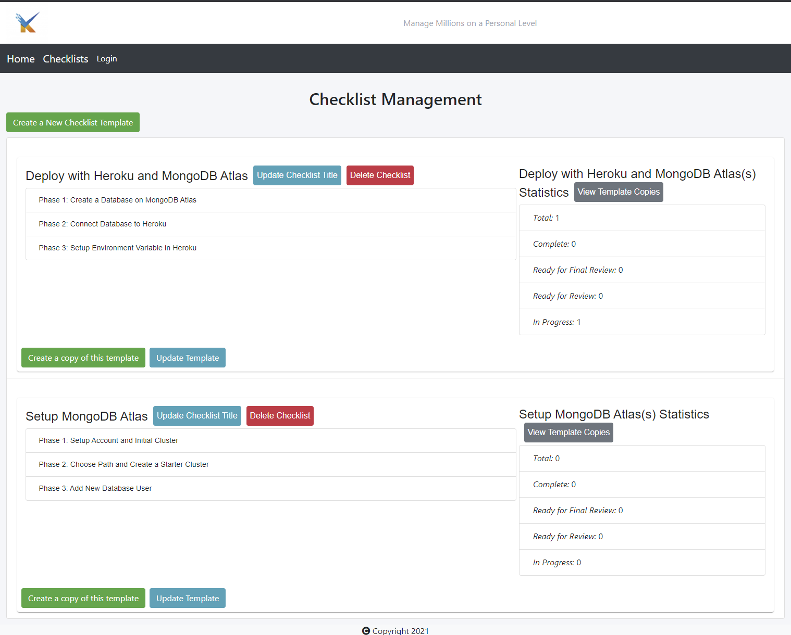

# Micro-Manage

## Description
Manage Millions on an Individual Level
## Table of Contents
* [`Project`](#)
* [`Description`](#Description)
* [`Table of Contents`](#Table-of-Contents)
* [`1nstallation Steps`](#Installation-Steps)
* [`Usage Information`](#Usage-Information)
* [`Testing`](#Testing)
* [`License`](#License)
* [`Contributing`](#Contributing)
* [`Questions`](#Questions)
* [`Sample`](#Sample)
## Installation Steps
To install this project, do the following:
> 1. Install on local host by cloning repository to local working directory
> 2. Ensure you have MongoDB service running
> 3. Copy the .env.EXAMPLE file to filename .env in same directory
> 4. Update variables in .env file to fit your system settings
> 5. run `npm install` from the base project directory command line
> 6. run `npm run seed`

## Usage Information
To use this project, do the following:
> 1. Ensure you have completed the installation steps successfully
> 2. Run `npm run start`
> 3. Open http://localhost:3000/ or whatever url you deployed your build to
> 4. You can now login, signup, create checklist templates, fill in checklists, update templates and checklists, delete templates and checklists, and logout

## Testing
To test this project, do the following:
> 1. Ensure you have completed the installation and usage steps successfully.
> 2. Test application by perfoming steps in the usage section until satisfied.

## License
This project is provided under the MIT license. For more information on license details click here 
## Contributing
Project Contributors are GitHub Users: 
> [willh33](http://github.com/willh33 "willh33")  
> [HeavensRegent](http://github.com/HeavensRegent "HeavensRegent")  
> [JYoung7223](https://github.com/JYoung7223 "JYoung7223")
## Questions
If you have any question about this repo, you may open an issue or contact me directly at jyoung7223@yahoo.com
You can find more of my work at [My Github Repo](https://github.com/JYoung7223 "My GitHub Repo")
## Sample
Deployed project can be found at: jy-micro-manage.herokuapp.com

Below is a sample screenshot:

