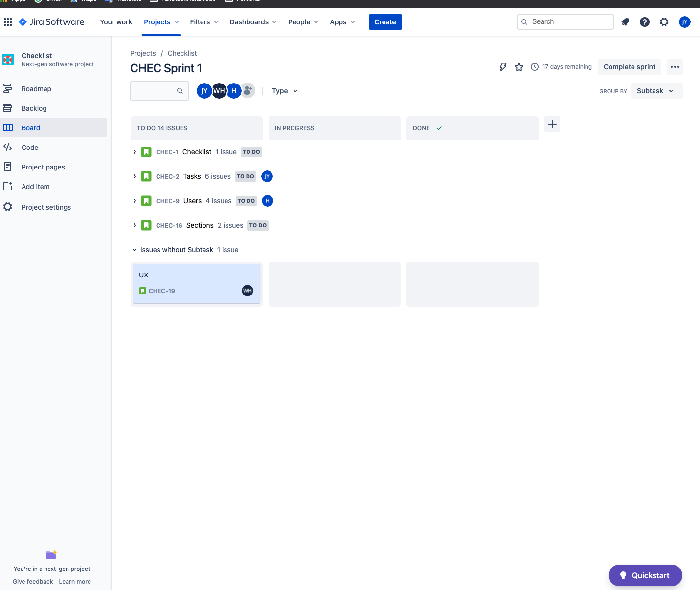

# Week 1: A detailed plan of action with the following:

1.  An overview of the intended application and WHY you feel it's valuable.
> * As a Manager, 
> * I want to make sure my minions follows my every command to the letter,
> * so that I may enforce my rule and dominion over my minions.

2. A breakdown of roles by group member.
> * Will - UX
> * Nate - Users, Back-End
> * Justin - Tasks

> Features - 
> - Checklist
>   - Has Sections, Tasks
> - Tasks
>   - Mark Task as completed, reviewed, signed-off
>   - Link task to template, resource, etc.
>   - Keep track of task statistics 
>       - time-open (this & on avg)
>       - time-to-sign-off (this & on avg)
> - Sections (Group of Tasks)
>   - Sequential grouping
>   - Customizable grouping (Function, Location, Resource, etc.)
> - Users
>   - Manager (Reviews, Sign-off tasks)
>   - Minion (completes tasks, submit for review)

3. A schedule for completion of various tasks.
> * Feb 10 - Project Decided
> * Feb 13 - Project Setup Completed, Tasks started
> * Feb 20 - Back-End CRUD Complete & Front-end Structure/Wire-Frames complete,
> * Feb 27 - Users & Tasks Completed
> * Mar 6 - Functionality finalized & deployed to production
> * Mar 8 - Finishing touches complete & Presentation Ready

4. A screenshot of your Jira, Trello, or Project Management Board that shows breakdown of tasks assigned to group members with a schedule.
> 

5. A set of DETAILED screen-by-screen design layouts with annotations describing all UI/UX components and all data relevant to the screen.
> * TBD